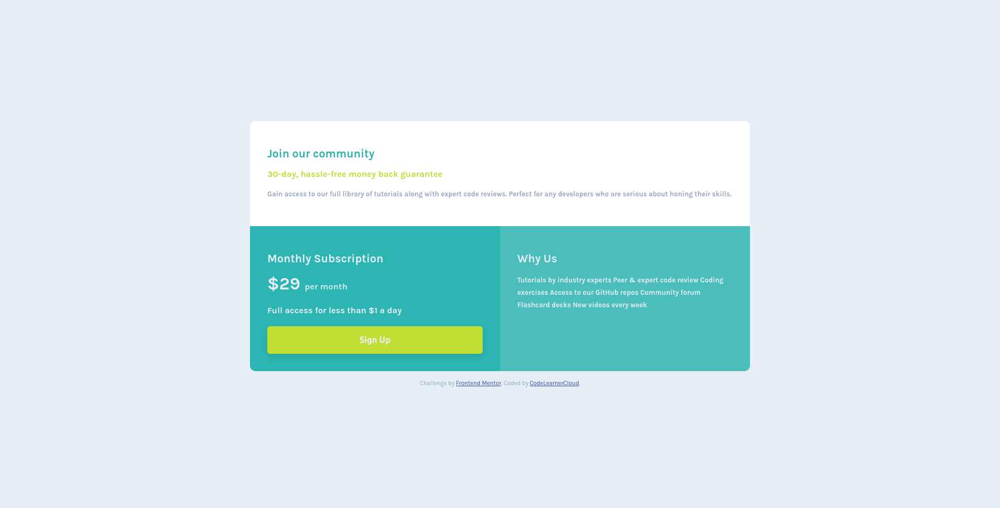

# Frontend Mentor - Single price grid component solution

This is a solution to the [Single price grid component challenge on Frontend Mentor](https://www.frontendmentor.io/challenges/single-price-grid-component-5ce41129d0ff452fec5abbbc). Frontend Mentor challenges help you improve your coding skills by building realistic projects. 

## Table of contents

- [Overview](#overview)
  - [The challenge](#the-challenge)
  - [Screenshot](#screenshot)
  - [Links](#links)
- [My process](#my-process)
  - [Built with](#built-with)
  - [Useful resources](#useful-resources)
- [Author](#author)

## Overview

### The challenge

Users should be able to:

- View the optimal layout for the component depending on their device's screen size
- See a hover state on desktop for the Sign Up call-to-action

### Screenshot

### Links

- Solution URL: [Github Repositories](https://github.com/CodeLearnerCloud/Single-Price-Grid-Component)
- Live Site URL: [Netlify](https://agitated-babbage-6ebd7b.netlify.app/)

## My process

### Built with

- Semantic HTML5 markup
- CSS custom properties
- Flexbox

### Useful resources

- [Anosha Ahmed](https://github.com/anoshaahmed/fem-single-price-component) - This helped me for CSS. I really liked this pattern and will use it going forward.

## Author

- Website - [CodeLearnerCloud](https://github.com/CodeLearnerCloud)
- Frontend Mentor - [@CodeLearnerCloud](https://www.frontendmentor.io/profile/CodeLearnerCloud)

